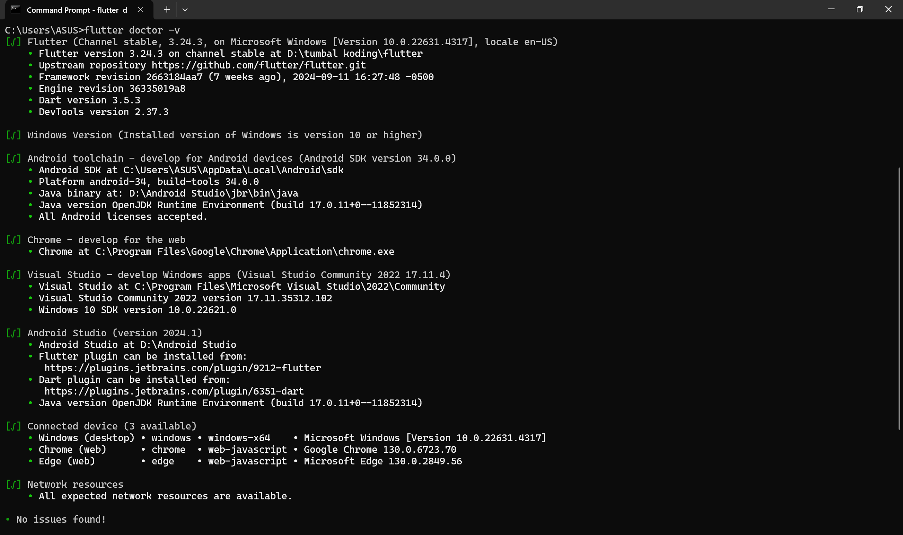
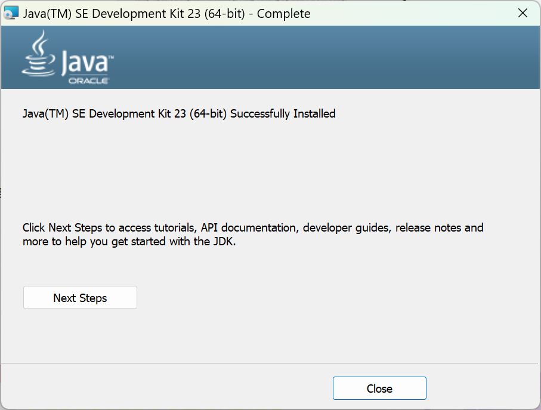
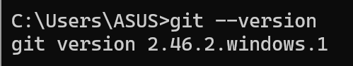

# PPB_Muhammad_Samudra_2211104062_SE0602/01_Running-Modul/LP_01

<li> Nama   : Muhammad Samudra
<li> NIM    : 2211104062
<li> Kelas  : SE-06-02

# Flutter terinstall
<li> Screenshot flutter sudah terinstall

# JDK Terinstall
<li> Screenshot installation JDK

# Android Studio terinstall
<li> Screenshot Android Studio sudah terinstall

# Git Terinstall
<li> Screenshot Screenshot terinstall git melalui cmd

# Installasi Extensions pada visual studio code
<li> Screenshot visual studio code dan extensions Dart juga Flutter

 

